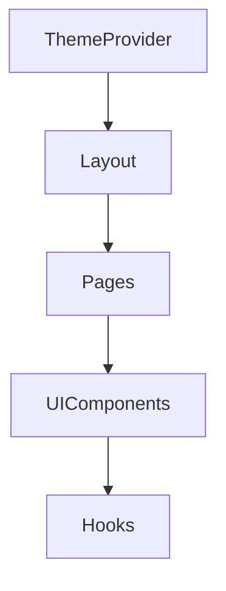
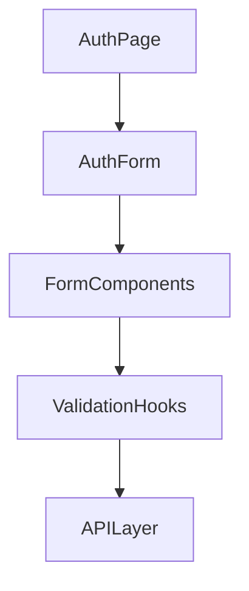

# System Patterns

## Architecture Overview

### App Router Structure
```
app/
├── auth/
│   ├── agency/
│   └── business/
├── dashboard/
│   ├── agency/
│   └── business/
└── layout.tsx
```

The project follows Next.js 14 App Router architecture with role-based routing.

## Design Patterns

### Component Architecture
1. **UI Components**
   - Located in `components/ui/`
   - Based on shadcn/ui library
   - Follows atomic design principles
   - Customizable through Tailwind CSS

2. **Layout Patterns**
   - Root layout in `app/layout.tsx`
   - Role-specific layouts for auth and dashboard

3. **Hook Patterns**
   - Custom hooks in `hooks/` directory
   - `use-mobile.tsx` for responsive design
   - `use-toast.ts` for notifications

### Authentication Pattern
- Separate authentication flows for agencies and businesses
- Role-based access control
- Protected dashboard routes

### State Management
- React hooks for local state
- Server components for data fetching
- Client components for interactivity

## Technical Decisions

### UI Framework
- shadcn/ui chosen for:
  - Accessibility
  - Customization
  - Type safety
  - Modern design patterns

### Styling Approach
- Tailwind CSS for utility-first styling
- Global styles in `app/globals.css`
- Component-level styles through Tailwind classes

### Mobile Responsiveness
- Mobile-first design approach
- Custom hook (`use-mobile.tsx`) for device detection
- Responsive UI components

## Component Relationships

### Theme System


### Authentication Flow


## Code Organization
1. **Components**
   - UI components in `components/ui/`
   - Theme provider in `components/`
   - Reusable across pages

2. **Hooks**
   - Custom hooks in `hooks/`
   - Shared functionality
   - Device detection
   - Toast notifications

3. **Public Assets**
   - Images and SVGs in `public/`
   - Placeholder assets for development

4. **Utilities**
   - Helper functions in `lib/utils.ts`
   - Shared across application
